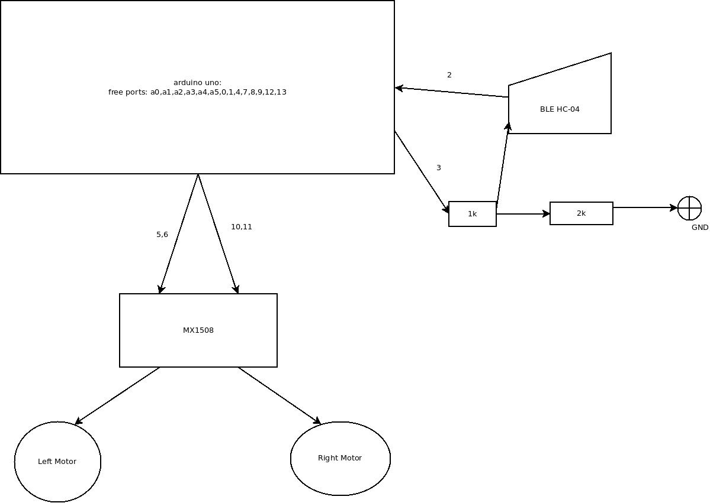
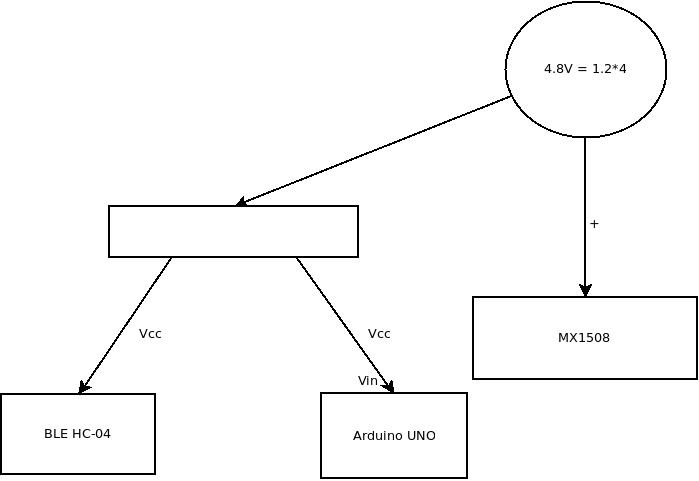

# CAR with BLE/WIFI and FS1000A

## CAR with BLE/WIFI
This will be controled using 

[Android application](https://github.com/gdimitriu/DroidControlCenter)

Power lines and signal connections for BLE:

The 2engines_bluetooth could be used with WIFI ESP-01 programmed with ESP01ToSerialAP.

## CAR with FS1000A (still in dev)

The controler from fs1000a is used to controll the car.

[fs100a](https://www.componentsinfo.com/fs1000a-433mhz-rf-transmitter-xy-mk-5v-receiver-module-explanation-pinout/)

The joystick use the transmitter and the car hold the receiver (is one way communication).
