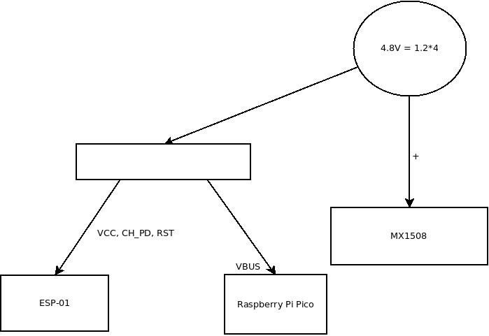

# CAR with BLE using RaspberryPi Pico

## CAR with BLE/WIFI
This will be controled using 

[Android application](https://github.com/gdimitriu/DroidControlCenter)

Power lines and signal connections:

## to use the WIFI with ESP-01

Upload the ESP01ToSerialAP to the ESP-01 using programmer.

[The programmer should be modified](https://www.instructables.com/USB-to-ESP-01-Board-Adapter-Modification/)

